# 项目介绍
计算机毕业设计，在线旅游购票网站，SpringBoot+Vue
包含前后端代码、开TI报告模板、答辩ppt、设计文档
# 需要源码数据库和文档请联系
V：bishe688

# 功能详情：
## 登录注册：
系统用户分为两类，管理员和普通用户。管理员通过别的管理员添加到系统，普通用户通过注册或者管理员添加进入系统。
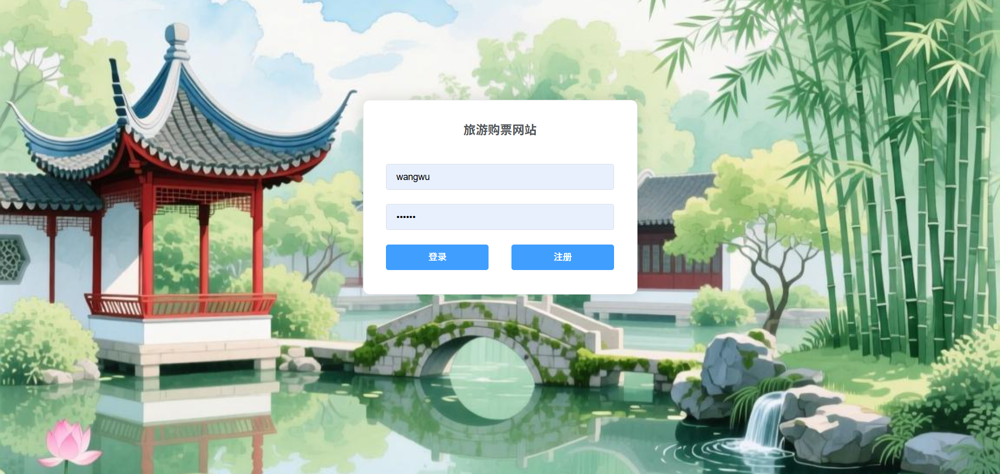

## 管理端功能：
- 用户管理：管理员可以管理用户信息，包括姓名、性别、出生日期、联系方式、登录账号、登录密码。
  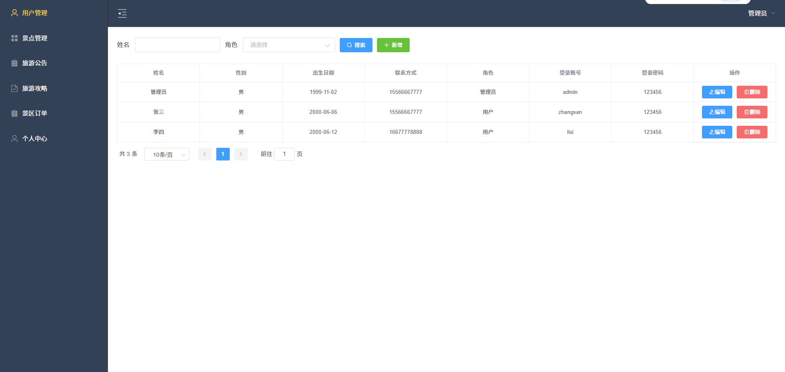
- 景点信息管理：包括景点名称、景点图片、景点简介、具体位置、建立时间、门票价格
  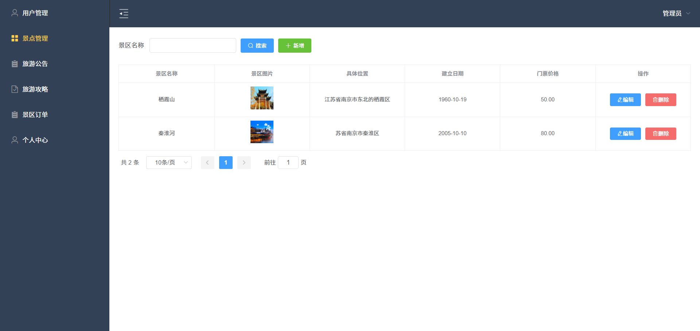
- 旅游公告管理：管理员可以发布发布旅游公告信息，包括公告标题、公告内容
  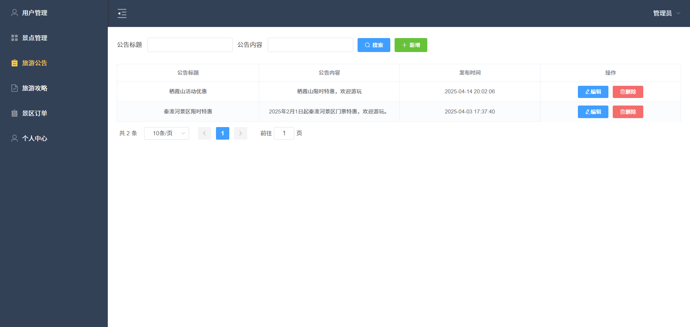
- 旅游攻略管理：管理员可以发布旅游攻略信息，包括攻略标题、攻略内容
  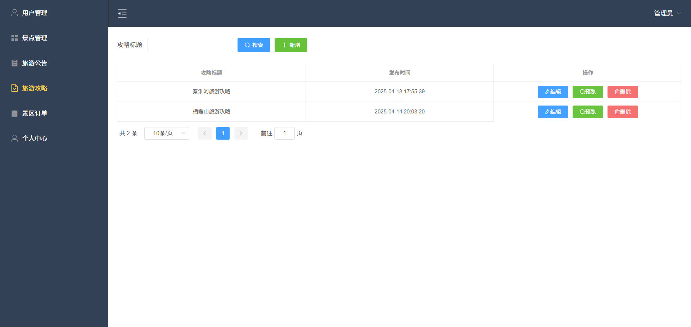
- 个人中心：管理员可以查看和修改个人信息
  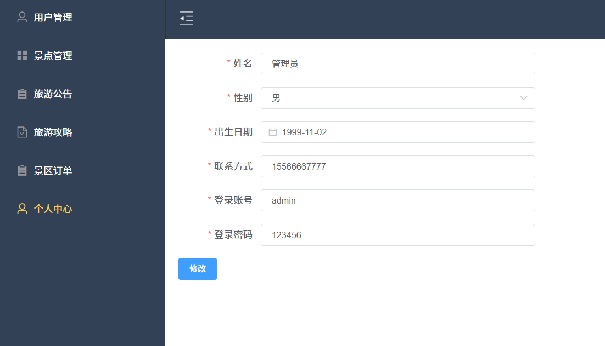
- 景区订单：管理员可以景区订单信息，包括预定景区、预约用户、预约人数、游玩日期、订单单价、订单总价、评价信息等。
  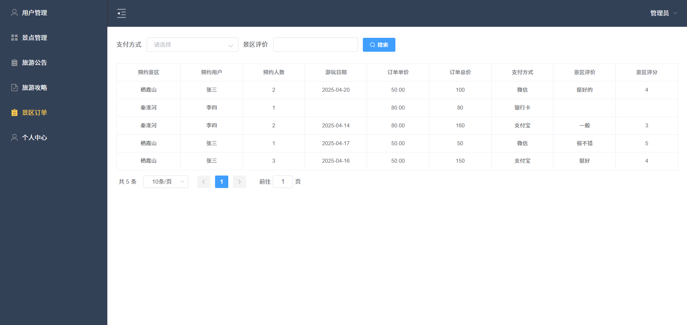

## 用户端功能：
- 景点预约：用户可以查看景点信息，包括景点名称、景点评价、景点详情，可以预约购票
  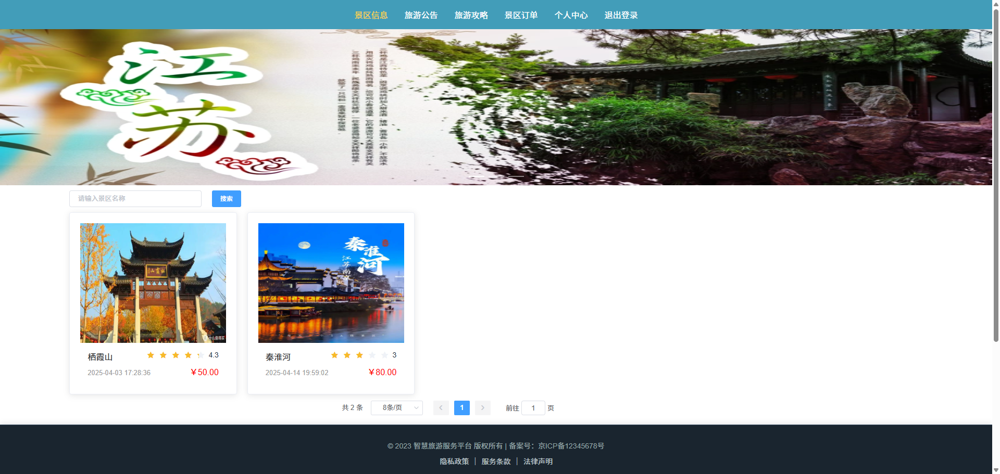
- 预约购票。
  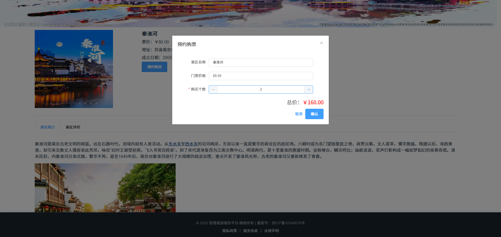
- 查看旅游攻略：用户可以查看管理员发布的旅游攻略，并进行评论。
  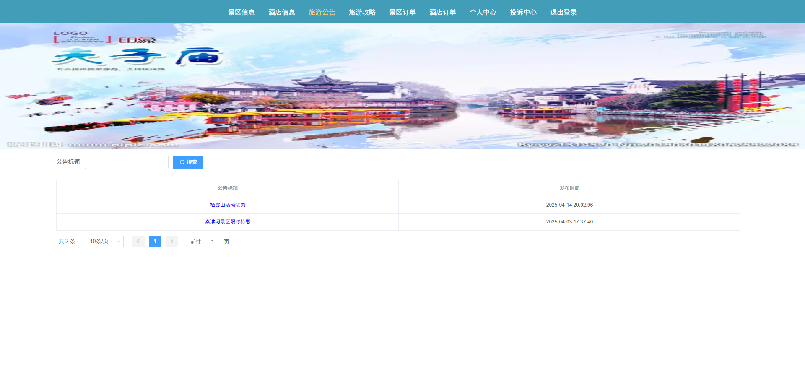
- 旅游攻略详情。
  
- 景区订单：用户可以查看自己的订单信息，并进行在线支付和。
  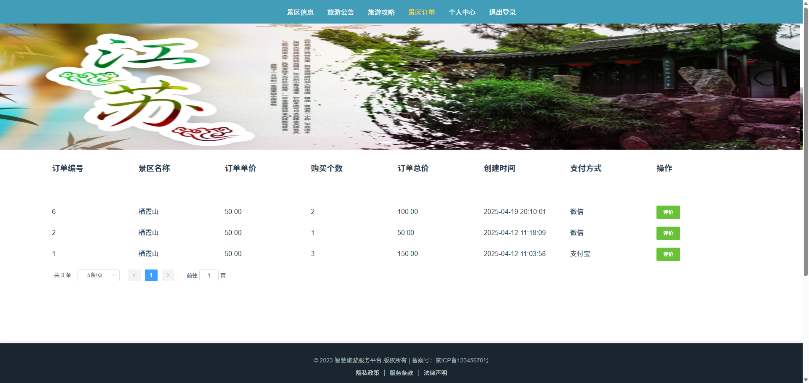
- 在线支付。
  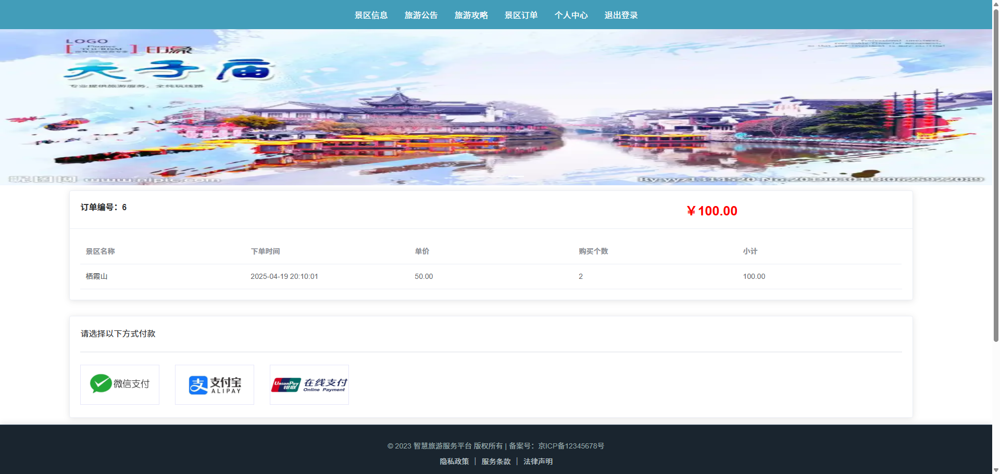
# 材料列表
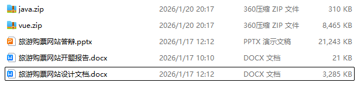

# 万字文档
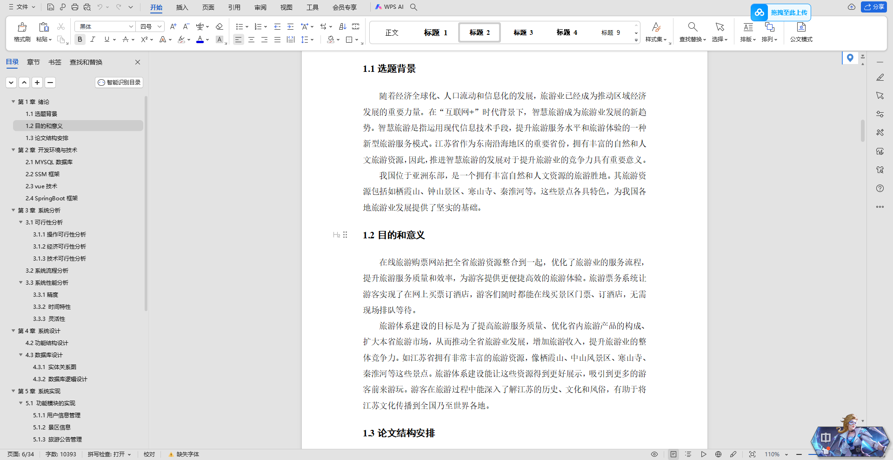

# 需要源码数据库和文档请联系
V：bishe688
