# 项目介绍
计算机毕业设计，在线旅游购票网站，SpringBoot+Vue
包含前后端代码、开TI报告模板、答辩ppt、设计文档（查重30%以下）
# 演示视频：
https://pan.baidu.com/s/1sYAzOalp_yjM9DB7oR0NqQ?pwd=vmem
# 功能详情：
## 登录注册
系统用户分为两类，管理员和普通用户。管理员通过别的管理员添加到系统，普通用户通过注册或者管理员添加进入系统。

## 管理端功能：
- 景点信息管理：包括景点名称、景点图片、景点简介、具体位置、建立时间、门票价格
  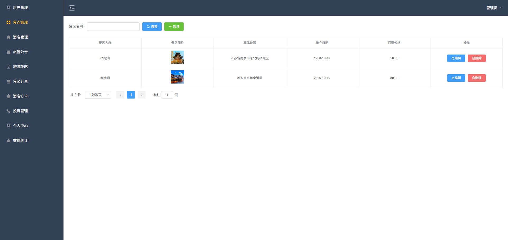
- 酒店信息管理：包括酒店名称、酒店图片、具体位置、房型信息(房型名称、房型价格、房型图片)
  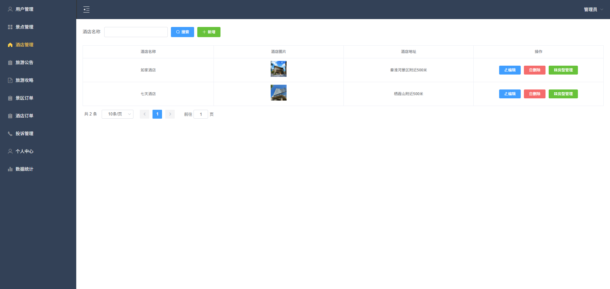
- 旅游公告展示：管理员可以发布发布旅游公告信息，包括公告标题、公告内容
  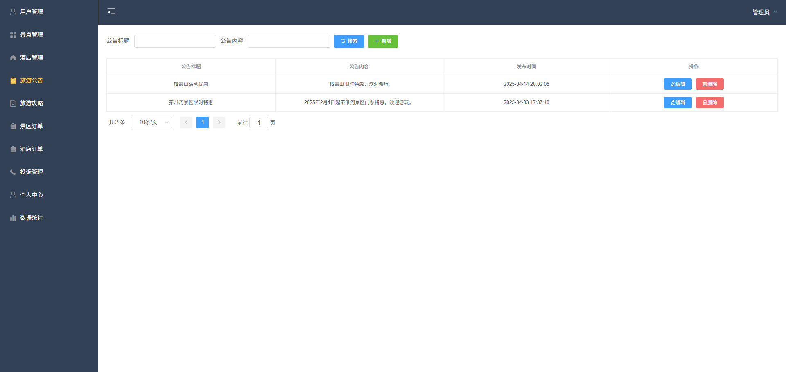
- 旅游攻略展示：管理员可以发布旅游攻略信息，包括攻略标题、攻略内容
  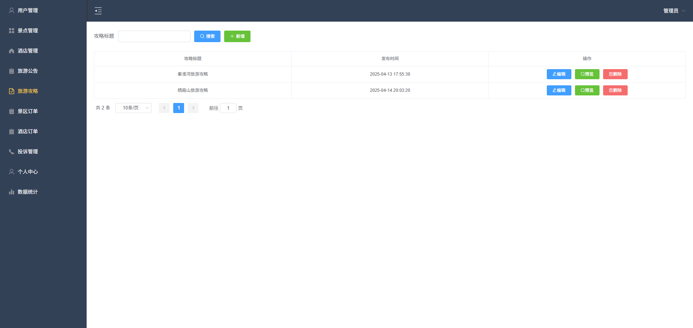
- 投诉处理：管理员可以查看投诉信息并进行处理
  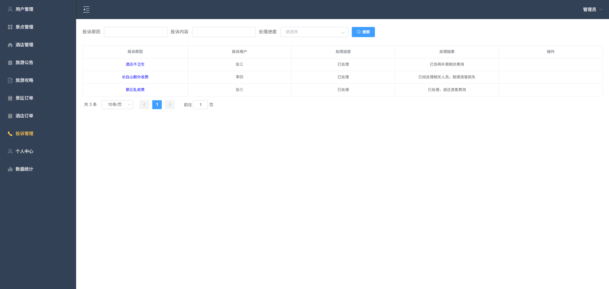
- 数据统计：管理员可以查看平台数据信息，包括注册用户个数、景点个数、订单个数、累计订单金额、近30天成交金额折线图。
  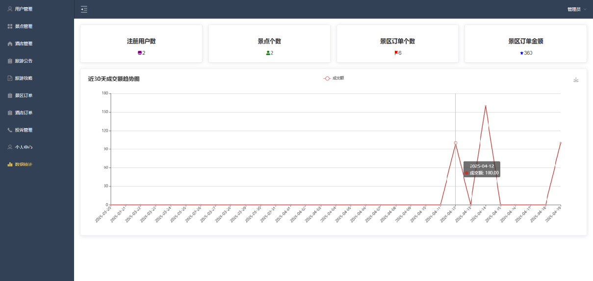

## 用户端功能：
- 景点预约：用户可以查看景点信息和推荐的景点(景点综合评分较高的)、景点详情，可以预约购票
  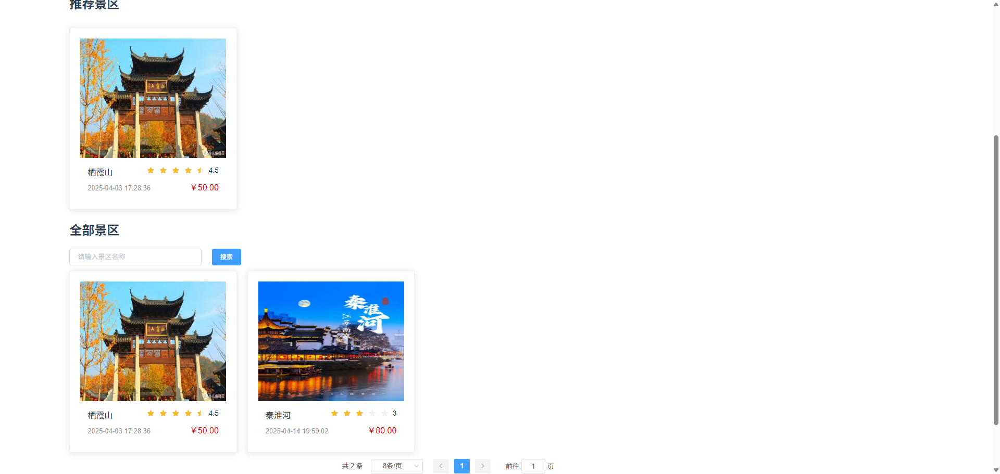
- 酒店预约功能：用户可以查看酒店信息和酒店详情，选择需要的房型预约入住
  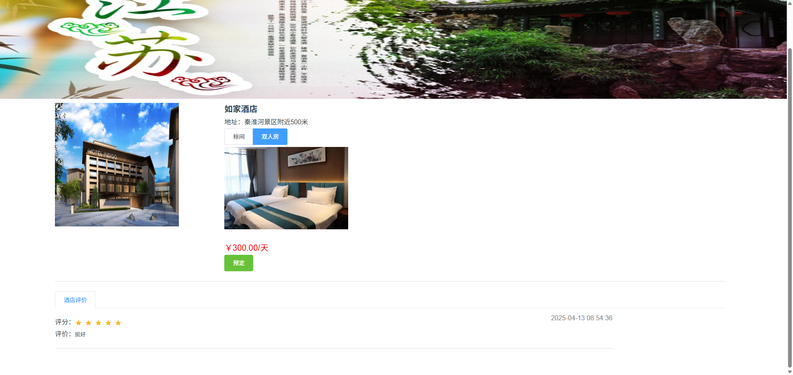
- 查看旅游公告：用户可以查看管理员发布的旅游公告
  
- 查看旅游攻略：用户可以查看管理员发布的旅游攻略，并进行评论。
  
- 景区订单：用户可以查看自己的订单信息，并进行在线支付和评论。
  
- 酒店订单：用户可以查看自己的酒店信息，并进行在线支付和评论。支付可以选择微信、支付宝、银行卡进行模拟支付
  
- 旅游投诉功能：用户可以发起投诉，包括投诉原因、投诉内容。
  
- 个人中心：用户可以查看和修改个人信息。
  

# 材料列表
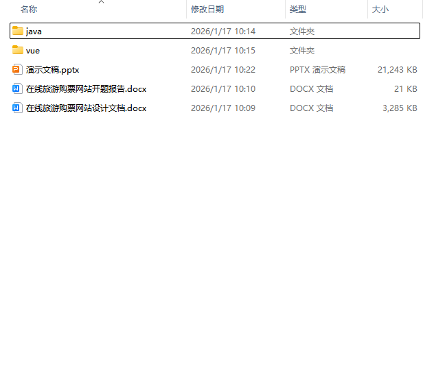

# 万字文档
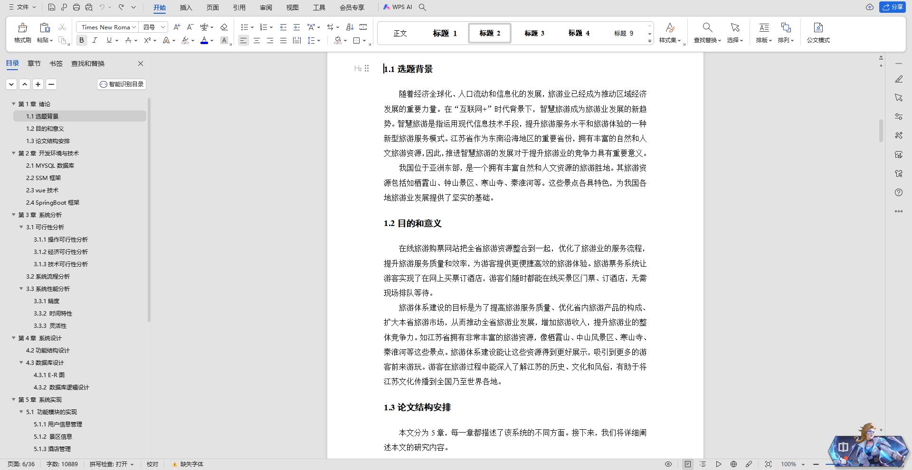

# 查重报告
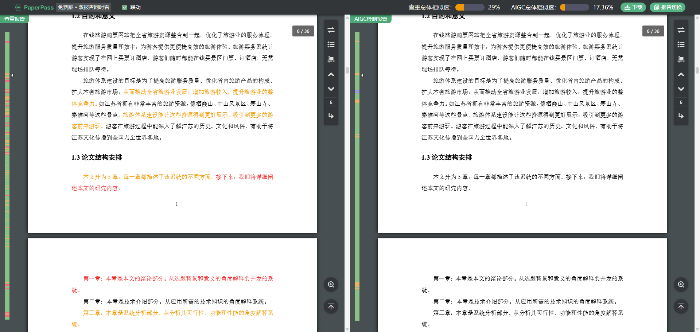

# 需要源码和数据库请联系
V：bishe688
